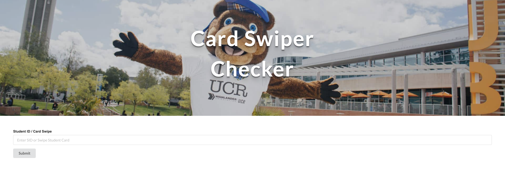
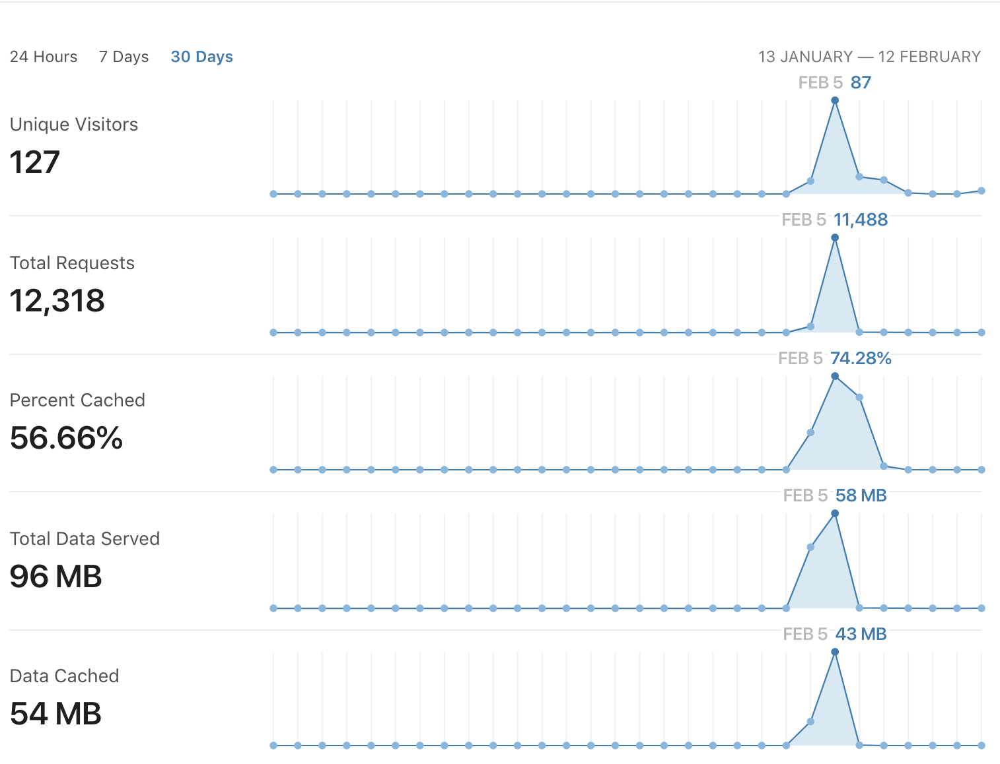

# UCR_Card_Swiper_Public

A simple web application for validating and recording UCR students information.

## Simple Card Swiper Interface



## Usage

This application was used by the Associated Students of UC Riverside (ASUCR) for their RGear event.
RGear is where ASUCR sponsors free sweaters for the undergraduate population of UC Riverside to promote
campus pride.
The event resulted in over 4,000 sweaters distributed on February 5th, 2019.
This application was deployed on [Digital Ocean Droplets](https://www.digitalocean.com/) and secured by [CloudFlare](https://www.cloudflare.com/).

## Impact

- This application increased the throughput of the distribution of sweaters from 4 hours to 2.5 hours (30% speedup).
- Enabled Data Collection about what type of students attend the event.

### CloudFlare Data



## How to use

```
Frontend

1. yarn install
2. yarn start

Backend

1. You must have a local mysql server running
2. Use the SQL Schema located in ./Backend/SQLSchema/RGearSchema.sql to build the local database.
3. yarn install
4. node server.js # Defaulted to port 8080
```
